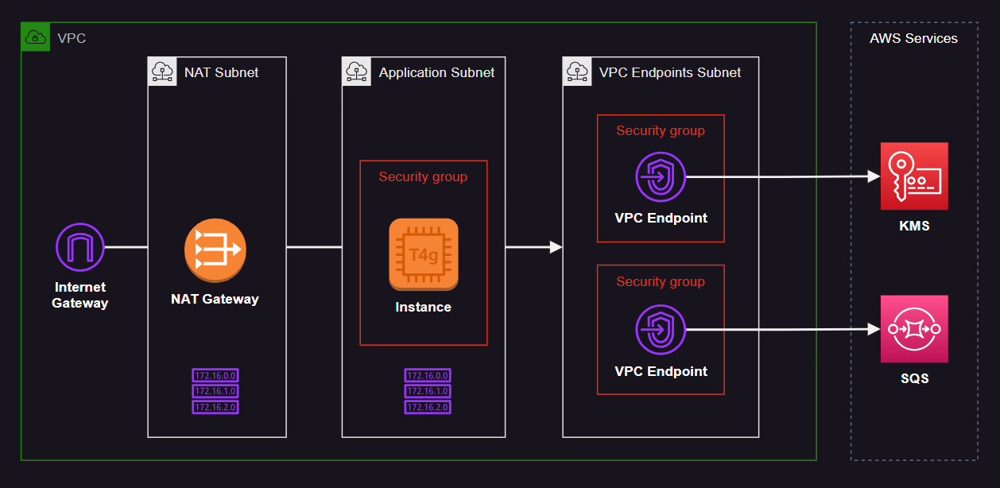

# AWS VPC Interface Endpoint

This sandbox implements a VPC Interface Endpoint to send messages to a SQS queue from an EC2 instance that runs in a private subnet.



In addition to provisioning the core resources, policies will be configured to use proper conditions.

The SQS queue will only accept `sqs:SendMessage` operations coming from the configured VPC Endpoint:

```json
"Condition": {
  "StringNotEquals": {
    "aws:sourceVpce": "vpce-1a2b3c4d"
  }
}
```

## Setup

Create the EC2 instance key pair material:

```sh
ssh-keygen -f modules/instance/ec2_id_rsa
```

To create the environment simply run:

```sh
terraform init
terraform apply -auto-approve
```

Connect to the EC2 instance:

```sh
aws ssm start-session --target i-00000000000000000 --region sa-east-1
```

Once the environment is created, connect to the EC2 instance using SSM. Confirm that the name is resolving to a private IP:

```sh
$ dig +short sqs.sa-east-1.amazonaws.com
10.0.50.54
```

Confirm that you're authenticated from within the EC2 instance:

```sh
aws sts get-caller-identity
```

Now send a message to the endpoint to the see the results:

```sh
aws sqs send-message --queue-url https://sqs.sa-east-1.amazonaws.com/000000000000/my-private-queue --message-body Hello
```

## Clean-up

```sh
terraform destroy
```

---

References:
- [Basic Amazon SQS policy examples](https://docs.aws.amazon.com/AWSSimpleQueueService/latest/SQSDeveloperGuide/sqs-basic-examples-of-sqs-policies.html)
- [SQS Endpoint Permissions](https://docs.aws.amazon.com/AWSSimpleQueueService/latest/SQSDeveloperGuide/sqs-internetwork-traffic-privacy.html#sqs-vpc-endpoints)
