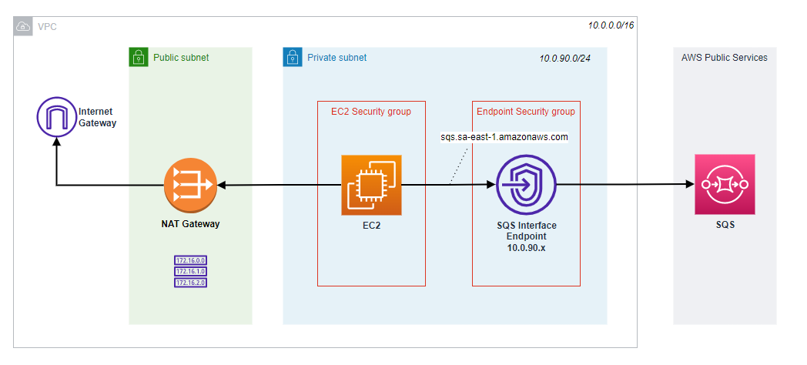

# AWS VPC Interface Endpoint sandbox

This sandbox implements a VPC Interface Endpoint to send messages to a SQS queue from an EC2 instance that runs in a private subnet.



## Setup

To create the environment simply run:

```sh
terraform init
terraform apply -auto-approve
```

Once the environment is created, connect to the EC2 instance using SSM. Confirm that the name is resolving to a private IP. The output should look something like this:

```
$ nslookup sqs.sa-east-1.amazonaws.com
Server:         127.0.0.53
Address:        127.0.0.53#53

Non-authoritative answer:
Name:   sqs.sa-east-1.amazonaws.com
Address: 10.0.90.76
```

Confirm that you're authenticated from within the EC2 instance:

```sh
aws sts get-caller-identity
```

Now send a message to the endpoint to the see the results:

```
$ aws sqs send-message --queue-url https://sqs.sa-east-1.amazonaws.com/000000000000/my-private-queue --message-body 'Hello'
{
    "MD5OfMessageBody": "8b1a9953c4611296a827abf8c47804d7",
    "MessageId": "d65550b7-6bad-4305-a9ae-fdf72e9a4296"
}
```

## Clean-up

```sh
terraform destroy
```

---

Reference: [Basic Amazon SQS policy examples](https://docs.aws.amazon.com/AWSSimpleQueueService/latest/SQSDeveloperGuide/sqs-basic-examples-of-sqs-policies.html)